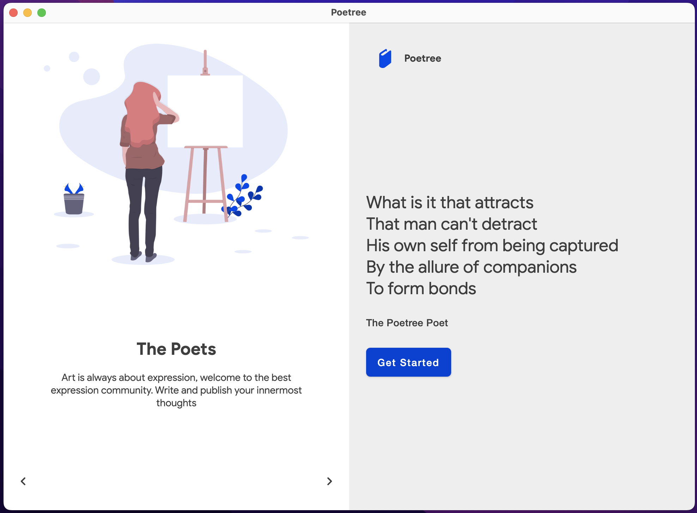

 

# Poetree
  

[Overview](#overview) •
[Features](#features) •
[Screenshots](#screenshots) •
[Contributing](#contributing) •
[Sponsor](#sponsor)

## Overview

The open community built for poetry lovers.

Poetree is a minimalistic poetry app that helps people freely access art from a global community full of poetry lovers. Whether a reader or a composer, we can all benefit from the beautiful and diverse library of poems and composers.

Why don't you give it a try?

## Features

Poetree provides the following features for users

- Viewing all published poems
- Searching poems by name or topics
- Users can read, like, bookmark and comment on poems
- Bookmarked poems can be saved offline to view later
- Composers can draft and later publish their own poems

## ScreenShots

| Android                                                               |                                                           iOS |
|:----------------------------------------------------------------------|--------------------------------------------------------------:|
|  |  |

|                          desktop                          |
|:---------------------------------------------------------:|
|  |

## Contributing

     

Your contributions are especially welcome.
Whether it comes in the form of code patches, ideas, discussion, bug reports, encouragement or criticism, your input is needed.

For any further question or any reference please reach out to any platform lead or open a discussion.

- Project [None](https://github.com/MamboBryan/poetree)
  - Android &#8594; [None](https://github.com/MamboBryan/poetree)
  - iOS &#8594; [Mike Ndiritu](https://github.com/ndiritumichael)
  - Web &#8594; [None](https://github.com/MamboBryan/poetree)
  - Desktop &#8594; [None](https://github.com/MamboBryan/poetree)
  - Backend &#8594; [None](https://github.com/MamboBryan/poetree)

## Sponsor

Poetree is a result of work of mostly small group of volunteers.

If you are a happy with this project, please consider [sponsoring us through Github Sponsors](https://github.com/sponsors/MamboBryan/).

Every sponsorship matters, as it directly increases the number of hours we can contribute to the project and makes the project more sustainable.