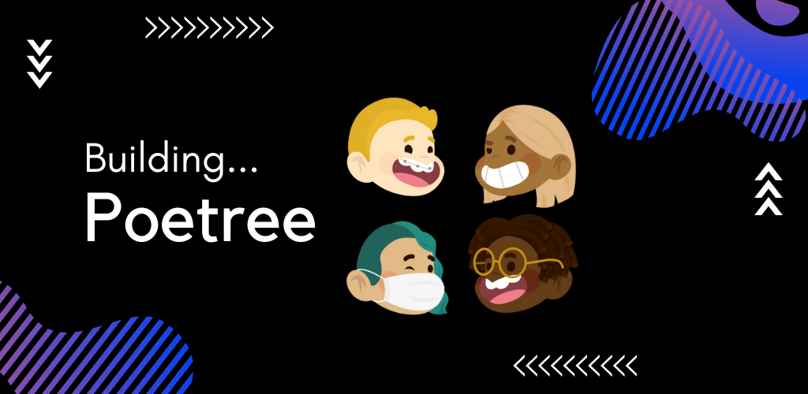

<p align="center">
<a href="https://day8.github.io/re-frame" target="_blank" width="20" rel="noopener noreferrer"></a></p>

# :building_construction: WIP : Poetree Backend

This is the poetree's app backend built with ktor.

## Endpoints

The details of the endpoints can be found [here](https://mambo-bryan.gitbook.io/poetree-api/)

For those who'd like test the endpoints on Postman or Insomnia I've added the compiled apis file in
the download folder [here](/downloads)

## Setup

- navigate to ```poetree/backend/src/zistshopping/application/Application.kt```
- run the ` main() ` function
    - it should not run successfully, this is because we haven't added environment variables
- add the following to your environment variables for the ``` Application.kt ``` run configurations
    - click on the dropdown next to the run button on intellij IDEA
    - select ` edit configurations `
    - paste the following inside the ` Environment Varibles ` input field
  ``` 
  JDBC_DATABASE=poetree;JDBC_DATABASE_URL=jdbc:postgresql:poetree?user=postgres;JDBC_DRIVER=postgresql;JDBC_PASSWORD=sudo;JDBC_USER=postgres;JWT_SECRET=123456789098765432;SECRET_KEY=123456789098765432;JDBC_DRIVER_CLASS=org.postgresql.Driver 
  ```
- re-run the ` main() ` function again
    - build SHOULD be successful
    - go to ` localhost:8080/v1/home ` and test if you receive a response
      ```json
      {
          "success": true,
          "message": "dang! you found me.",
          "data": {
          "artist": "Mr.Brush",
          "message": "Now that you found me. Proceed!",
          "tip": "add a slash at the end",
          "why": [
          "Cause you're awesome",
          "You have come too far",
          "I'll look for you, and find you! ;)"
          ]
        } 
      }
      ```

- You're Ready To Go :rocket:

## The Rest

This is a WIP (work in progress) so there are many changes taking place. Feel free to reach out to
me for any clarification

